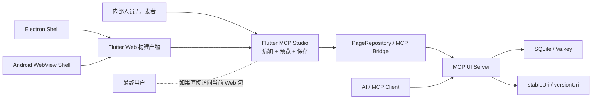
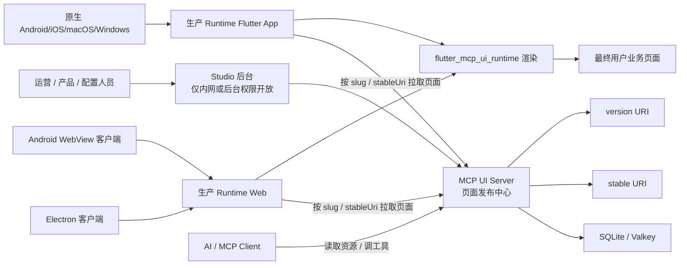

# Flutter MCP Runtime

一个独立于 Studio 的轻量 Runtime 应用，只负责：

- 从 `MCP UI Server` 读取已发布页面
- 按 `slug`、`version` 或 `mcpui://` 资源 URI 拉取页面 JSON DSL
- 使用 `flutter_mcp_ui_runtime` 把页面渲染成真正的 Flutter UI

它不包含 Studio 的编辑、拖拽、JSON 侧栏等后台能力。

## 为什么要单独拆出 Runtime App

前面的分析里，我们把 `Studio` 和 `Runtime` 分开，核心原因有 4 个：

1. Studio 是内部编辑后台，不适合直接暴露给最终用户。
2. 生产前台应该尽量轻，只负责“读取页面配置并渲染”。
3. 页面 JSON DSL 应该成为 Studio 和前台应用之间的稳定契约。
4. 只有把 Runtime 独立出来，Web、Electron、Android WebView、原生 Flutter 多端复用才会更清晰。

换句话说：

- `Studio` 负责“做页面、改页面、发布页面”
- `Runtime` 负责“拿到已发布页面并展示给用户”

## 当前仓库现状图



这也是为什么我们不建议直接把 `flutter_mcp_studio` 当成生产前台上线。

## 推荐的生产拆分图



这个新建的 `flutter_mcp_runtime` 就是往这张图里的 `生产 Runtime Flutter App / Runtime Web` 方向落地的第一步。

## 多端支持结论

从技术架构上，这套方案是支持多端的：

- Web
- Electron
- Android WebView
- 原生 Flutter Android / iOS / macOS / Windows / Linux

当前这个新 Runtime 项目已经生成了：

- `web`
- `android`

如果后续要继续扩展到更多 Flutter 平台，可以再执行一次：

```bash
flutter create . --platforms=web,android,ios,windows,macos,linux
```

## 运行方式

先启动服务端：

```bash
cd /Users/xiaochen/Downloads/flutter-mcp
./scripts/run-server.sh
```

再启动 Runtime Web：

```bash
cd /Users/xiaochen/Downloads/flutter-mcp
./scripts/run-runtime-web.sh
```

## 支持的启动参数

Runtime 支持 2 类入口参数：

- `dart-define`
- Web URL query 参数

### 1. 指定服务端地址

```bash
flutter run -d chrome \
  --dart-define=MCP_UI_SERVER_URL=http://127.0.0.1:8787
```

或：

```text
http://localhost:xxxx/?server=http://127.0.0.1:8787
```

### 2. 按页面 slug 加载

```bash
flutter run -d chrome \
  --dart-define=MCP_UI_SERVER_URL=http://127.0.0.1:8787 \
  --dart-define=MCP_UI_PAGE_SLUG=dashboard
```

或：

```text
http://localhost:xxxx/?slug=dashboard
```

### 3. 按固定版本加载

```bash
flutter run -d chrome \
  --dart-define=MCP_UI_SERVER_URL=http://127.0.0.1:8787 \
  --dart-define=MCP_UI_PAGE_SLUG=dashboard \
  --dart-define=MCP_UI_PAGE_VERSION=v20260404131626-625
```

或：

```text
http://localhost:xxxx/?slug=dashboard&version=v20260404131626-625
```

### 4. 按资源 URI 加载

```bash
flutter run -d chrome \
  --dart-define=MCP_UI_SERVER_URL=http://127.0.0.1:8787 \
  --dart-define=MCP_UI_PAGE_URI=mcpui://pages/dashboard/stable
```

或：

```text
http://localhost:xxxx/?uri=mcpui://pages/dashboard/stable
```

## 构建说明

Web release 构建请优先使用仓库根目录脚本：

```bash
cd /Users/xiaochen/Downloads/flutter-mcp
./scripts/build-runtime-web.sh
```

原因是当前依赖组合下，`flutter_mcp_ui_runtime` 会触发 icon tree shaking 问题，构建时需要显式关闭。

## 适合的生产接入方式

这个 Runtime app 更适合作为：

- 一个独立的 Web 前台
- 一个原生 Flutter 前台应用
- 一个被 Electron 或 WebView 容器加载的前端 runtime

而 `Studio` 继续作为内部编辑后台存在。这样职责清晰，也更符合生产系统拆分。
