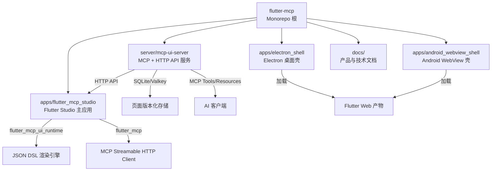
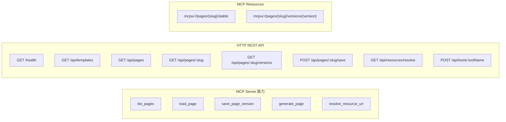
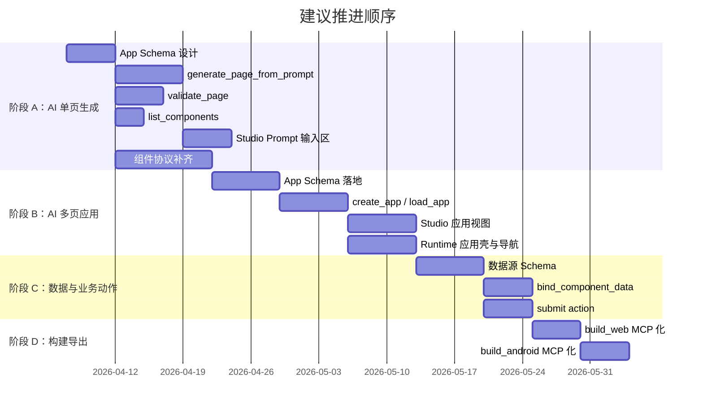

# Flutter MCP Configurable UI Studio — 项目分析报告

## 1. 项目概览

**一句话定位**：通过 AI 调用 MCP 来构建页面与应用的可视化生成平台。

本项目构建了一个 `AI + MCP + Studio + Runtime + Build` 的闭环系统，让用户可以通过自然语言驱动页面生成、可视化编辑、版本固化和多端构建。

---

## 2. 仓库结构全景

### 技术栈

| 层级 | 技术 | 说明 |
|------|------|------|
| **MCP Server** | TypeScript + Express 5 + `@modelcontextprotocol/sdk@^1.29` | 同时暴露 HTTP REST API 和 MCP Streamable HTTP 端点 |
| **存储** | better-sqlite3 (默认) / Redis (可选 Valkey) | 页面以 JSON 存储，支持版本化和稳定 URI |
| **Flutter Studio** | Dart + Flutter + Provider | 使用 `flutter_mcp_ui_runtime` 渲染 DSL |
| **Runtime 依赖** | `flutter_mcp@^1.0.5` / `flutter_mcp_ui_core@^0.2.3` / `flutter_mcp_ui_runtime@^0.2.5` | 第三方 pub 包 |
| **本地持久化** | Hive Flutter | 本地草稿存储 |
| **桌面壳** | Electron | 加载 Flutter Web 构建产物 |
| **移动壳** | Android 原生 WebView | 最小化容器 |

---

## 3. 现有功能实现分析

### 3.1 MCP UI Server（服务端）

**已实现能力**：

| 功能 | 状态 | 说明 |
|------|------|------|
| 页面 CRUD | ✅ 完成 | 列表 / 读取 / 保存 / 版本化一套完整 |
| 模板页生成 | ✅ 完成 | 从 seed pages 克隆，支持 dashboard/form/table |
| 版本管理 | ✅ 完成 | 每次保存创建不可变版本，稳定 URI 始终指向最新 |
| 资源 URI 解析 | ✅ 完成 | 支持 `mcpui://` 协议解析 |
| 种子页导入 | ✅ 完成 | 启动时从 Flutter assets 导入三个样例页 |
| 双传输模式 | ✅ 完成 | 同时支持 HTTP 和 stdio 两种 MCP 传输 |
| 双后端存储 | ✅ 完成 | SQLite (默认) + Valkey (可选) |
| HTTP API bridge | ✅ 完成 | `/api/tools/:toolName` 暴露所有 tool 为 REST |

> [!TIP]
> 服务端代码质量较好，`PageStore` 接口定义清晰，SQLite 和 Valkey 两套实现完整分离，`ToolService` 作为业务逻辑层统一被 MCP 和 HTTP 两端调用，避免了重复逻辑。

### 3.2 Flutter Studio（客户端）

**已实现能力**：

| 功能 | 状态 | 说明 |
|------|------|------|
| 页面列表加载 | ✅ 完成 | 优先从服务端拉取，回退到 bundled assets |
| 版本列表查看 | ✅ 完成 | 支持按版本切换加载 |
| 页面预览渲染 | ✅ 完成 | 通过 `MCPUIRuntime` 实时渲染 JSON DSL |
| JSON 直接编辑 | ✅ 完成 | 右侧面板直接编辑 JSON 并应用到预览 |
| 拖拽排序 | ✅ 完成 | 通过 `ReorderableListView` 实现顶层区块排序 |
| 组件块快速添加 | ✅ 完成 | 支持添加 KPI、表格、操作条、说明四种组件块 |
| 本地草稿 | ✅ 完成 | 使用 Hive 自动保存/恢复草稿 |
| 页面固化保存 | ✅ 完成 | 保存到服务端并创建新版本 |
| MCP 连接 | ✅ 完成 | 通过 `flutter_mcp` 建立 Streamable HTTP 连接 |
| Tool Action 执行 | ✅ 完成 | `persistPage` 和 default executor 已注册 |
| 自适应布局 | ✅ 完成 | 宽屏三栏 / 窄屏 Tab 切换 |

### 3.3 Antd 风格自定义组件

| 组件 | 类型标识 | 说明 |
|------|---------|------|
| `AntdSection` | `antdSection` | 白底卡片区块，带标题/副标题/阴影 |
| `AntdStat` | `antdStat` | KPI 统计卡，支持 4 种色调梯度 |
| `AntdTable` | `antdTable` | DataTable 风格表格，状态标签渲染 |

### 3.4 多端容器

| 容器 | 状态 | 说明 |
|------|------|------|
| Flutter Web | ⚠️ 未验证 | 代码存在，但未在当前机器编译 |
| Android debug | ✅ 已验证 | APK 可构建安装 |
| Electron | ⚠️ 未验证 | 代码完整，未实际加载 Flutter Web |
| Android WebView | ⚠️ 未验证 | 原生壳存在，未编译 |

---

## 4. 当前架构的优势与不足

### ✅ 优势

1. **架构清晰**：Server / Studio / Runtime / Shell 职责分明，单一仓库统一管理
2. **MCP 协议规范**：正确使用了 `@modelcontextprotocol/sdk` 的 `McpServer`、`ResourceTemplate`、`StreamableHTTPServerTransport`
3. **双通道设计**：Tool 同时暴露为 MCP tool 和 HTTP REST API，提高了可用性
4. **版本化机制成熟**：不可变版本 + 稳定 URI 的设计符合 MCP 资源语义
5. **渐退策略**：服务端不可用时自动回退到 bundled 样例，保证 Demo 可跑通
6. **本地草稿与固化分离**：编辑不直接影响服务端版本，减少误操作

### ⚠️ 不足 / 技术债务

1. **`generate_page` 本质是模板克隆**：当前只是从 seed pages 复制，不具备 AI 生成能力
2. **MCP 客户端仅完成建连**：`McpBridgeService` 初始化了 `flutter_mcp` 客户端，但 tool action 实际走的是 HTTP API bridge，原生 MCP tool call 未真正使用
3. **组件协议较少**：目前只有 3 个自定义组件 + runtime 内置的 `button/select/text/linear`，无法支撑复杂业务页面
4. **无 Schema 校验**：DSL 完全依赖"尽量容错"渲染，无结构化校验
5. **无 App Schema**：只有页面级概念，没有应用级建模（路由、导航、主题、全局状态）
6. **Studio 单文件过大**：`studio_home_page.dart` (521 行) 和 `studio_controller.dart` (468 行) 承载了全部逻辑，后续难以维护
7. **无测试覆盖**：`test/` 目录为空，无单元测试或集成测试
8. **Electron 壳极简**：仅一个 `main.js`，无 preload 脚本、无 IPC、无自动更新

---

## 5. 开发计划审查

项目文档包含两份关键规划文件：

- [product-roadmap.md](file:///Users/xiaochen/Downloads/flutter-mcp/docs/product-roadmap.md) — 产品路线图（5 阶段 + 5 里程碑）
- [technical-task-breakdown.md](file:///Users/xiaochen/Downloads/flutter-mcp/docs/technical-task-breakdown.md) — 技术任务拆解（5 条主线 × 5 阶段）

### 5.1 路线图阶段与当前进度对照

| 阶段 | 目标 | 当前进度 | 评估 |
|------|------|---------|------|
| **阶段 0：基础平台打通** | 可编辑、可渲染、可保存、可打包 | ✅ 基本完成 | 出口标准已满足 |
| **阶段 1：AI 单页生成 MVP** | 输入需求 → 生成页面 → Studio 编辑 | ❌ 未开始 | 需新增 `generate_page_from_prompt`、`validate_page`、组件白名单 |
| **阶段 2：AI 多页应用 MVP** | 生成应用骨架 | ❌ 未开始 | 需设计 App Schema |
| **阶段 3：数据与业务动作** | 连接真实数据源 | ❌ 未开始 | 需数据绑定模型 |
| **阶段 4：AI 构建导出** | AI 触发构建 | ❌ 未开始 | 需 MCP 化构建流程 |
| **阶段 5：发布级能力** | 可交付、可治理 | ❌ 未开始 | 需测试、回滚、审计 |

> [!IMPORTANT]
> **当前处于阶段 0 → 阶段 1 的过渡期。** 阶段 0 的核心链路已打通，下一步应集中精力进入 AI 单页生成 MVP。

### 5.2 技术任务拆解的合理性评估

路线图提出了 5 条主线并行推进的建议：

**评估意见**：

| 维度 | 评价 |
|------|------|
| **阶段划分** | ✅ 合理，从页面到应用到数据到构建，复杂度递增 |
| **优先级排序** | ✅ 合理，先 Schema 后 AI tool，先单页后多页 |
| **任务粒度** | ⚠️ 部分过粗，如"补齐组件协议"包含 17+ 个组件，应进一步拆解 |
| **风险识别** | ⚠️ 缺少对 AI 生成质量不可控的风险预案 |
| **依赖关系** | ✅ 明确标注了任务间依赖 |
| **验收标准** | ✅ 每个阶段都有出口标准 |

---

## 6. 后续规划建议

### 6.1 立即可做（阶段 1：AI 单页生成 MVP）

按优先级排序，建议先启动以下 6 项工作：

| # | 任务 | 说明 | 工作量估计 |
|---|------|------|-----------|
| 1 | **设计 App Schema 初版** | 定义 `appId/slug/name/routes/navigation/pages/theme` 等字段，JSON Schema 文档化 | 2-3 天 |
| 2 | **实现 `generate_page_from_prompt`** | 接入 LLM API，输入 prompt + 组件白名单，输出 Page DSL 草稿 | 5-7 天 |
| 3 | **实现 `validate_page`** | 基于 JSON Schema 校验 DSL 结构，返回错误位置和修复建议 | 3-5 天 |
| 4 | **实现 `list_components`** | 返回当前已注册组件的协议描述（属性、类型、约束） | 2-3 天 |
| 5 | **Studio 新增 AI Prompt 输入区** | 在 Studio 中添加 prompt 输入框，调用 `generate_page_from_prompt`，结果直接进入预览 | 3-5 天 |
| 6 | **扩充组件库** | 优先补齐 `form` / `input` / `tabs` / `modal` / `descriptions` | 5-7 天 |

### 6.2 中期规划（阶段 2-3）

1. **App Schema 落地**：服务端新增 `apps` 表 + MCP tools (`create_app` / `load_app` / `save_app_version`)
2. **Runtime 应用壳**：导航容器 + 页面路由切换 + 主题注入
3. **数据绑定**：标准化 `data action` + `submit action` + mock 数据源

### 6.3 长期规划（阶段 4-5）

1. **构建 MCP 化**：将 `flutter build web` / `flutter build apk` 包装为 MCP tool
2. **发布级能力**：release 签名、版本 diff/回滚、审计日志、自动化测试

### 6.4 建议改进的技术债务

| 项目 | 建议 |
|------|------|
| **Studio 代码拆分** | 将 `studio_home_page.dart` 拆为 `page_rail.dart`、`preview_panel.dart`、`editor_panel.dart` 三个独立 Widget |
| **MCP 客户端真实调用** | 将 `invokeRuntimeTool` 从 HTTP API bridge 切换到 `flutter_mcp` 原生 MCP tool call |
| **添加测试** | 为 `ToolService`、`SqlitePageStore`、`StudioController` 添加单元测试 |
| **错误处理增强** | 服务端添加全局错误中间件，客户端添加 retry 和超时机制 |
| **CI/CD** | 添加 GitHub Actions 实现 TypeScript lint + Flutter analyze + 构建验证 |

---

## 7. 总结

这是一个架构清晰、目标明确的项目，当前已完成"基础平台打通"（阶段 0）的全部核心链路。产品路线图和技术任务拆解的规划方向合理，阶段划分符合渐进式推进的原则。

**当前最关键的下一步**是进入 **阶段 1：AI 单页生成 MVP**，核心工作是：
1. 设计 App Schema
2. 实现 AI 页面生成 MCP tool
3. 补齐组件协议
4. 在 Studio 中打通 AI 生成 → 预览 → 固化的闭环

一旦阶段 1 完成，项目就从"可编辑 Demo"跃升为"AI 构建平台"，具备了核心产品价值。
